# Document Type Ontology - Tree Visualization

**Legend:** Square nodes `[ ]` are branches (have children). Rounded nodes `([ ])` are leaves (schema targets).

---

## Overview (Roots Only)

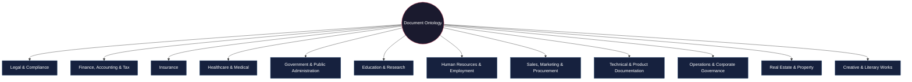

---

## 1. Legal & Compliance

```mermaid
graph TD
    R1[Legal & Compliance]

    R1 --> L1_1[Contracts & Agreements]
    R1 --> L1_2[Court & Litigation]
    R1 --> L1_3[Regulatory & Compliance]
    R1 --> L1_4[Intellectual Property]
    R1 --> L1_5[Corporate Legal]
    R1 --> L1_6([Notarial & Certified Documents])

    L1_1 --> L1_1_1([Service & Commercial Agreements])
    L1_1 --> L1_1_2([Confidentiality Agreements])
    L1_1 --> L1_1_3([Employment & Contractor Agreements])
    L1_1 --> L1_1_4([Licensing & Royalty Agreements])
    L1_1 --> L1_1_5([Partnership & Joint Venture Agreements])
    L1_1 --> L1_1_6([Letters of Intent & Preliminary Agreements])

    L1_2 --> L1_2_1([Pleadings & Motions])
    L1_2 --> L1_2_2([Court Orders & Judgments])
    L1_2 --> L1_2_3([Discovery Documents])
    L1_2 --> L1_2_4([Settlement & Resolution])
    L1_2 --> L1_2_5([Evidence & Supporting Documents])

    L1_3 --> L1_3_1([Compliance Reports & Assessments])
    L1_3 --> L1_3_2([Regulatory Filings & Registrations])
    L1_3 --> L1_3_3([Compliance Audits])
    L1_3 --> L1_3_4([Sanctions & Enforcement Actions])

    L1_4 --> L1_4_1([Patents])
    L1_4 --> L1_4_2([Trademarks])
    L1_4 --> L1_4_3([Copyrights])
    L1_4 --> L1_4_4([Trade Secrets & Proprietary Information])

    L1_5 --> L1_5_1([Formation & Entity Documents])
    L1_5 --> L1_5_2([Bylaws & Governing Documents])
    L1_5 --> L1_5_3([Shareholder & Equity Documents])
    L1_5 --> L1_5_4([Corporate Resolutions & Authorizations])

    classDef branch fill:#16213e,color:#fff,stroke:#0f3460
    classDef leaf fill:#0f3460,color:#fff,stroke:#53a8b6
    class R1,L1_1,L1_2,L1_3,L1_4,L1_5 branch
```

---

## 2. Finance, Accounting & Tax

```mermaid
graph TD
    R2[Finance, Accounting & Tax]

    R2 --> L2_1[Banking & Investments]
    R2 --> L2_2[Financial Reporting]
    R2 --> L2_3([Bookkeeping & Ledgers])
    R2 --> L2_4[Invoicing & Payments]
    R2 --> L2_5[Tax Filings & Records]
    R2 --> L2_6[Audit]

    L2_1 --> L2_1_1([Bank Accounts & Statements])
    L2_1 --> L2_1_2([Loans & Credit Facilities])
    L2_1 --> L2_1_3([Investment Records])
    L2_1 --> L2_1_4([Fund Documentation])

    L2_2 --> L2_2_1([Financial Statements])
    L2_2 --> L2_2_2([Periodic & Annual Reports])
    L2_2 --> L2_2_3([Consolidated & Segment Reporting])

    L2_4 --> L2_4_1([Invoices])
    L2_4 --> L2_4_2([Receipts & Payment Confirmations])
    L2_4 --> L2_4_3([Credit & Debit Notes])
    L2_4 --> L2_4_4([Billing Statements & Notices])

    L2_5 --> L2_5_1([Tax Returns & Declarations])
    L2_5 --> L2_5_2([Tax Assessments & Notices])
    L2_5 --> L2_5_3([Withholding & Information Reporting])
    L2_5 --> L2_5_4([Transfer Pricing Documentation])

    L2_6 --> L2_6_1([Audit Reports])
    L2_6 --> L2_6_2([Audit Planning & Engagement])
    L2_6 --> L2_6_3([Management Letters & Remediation])

    classDef branch fill:#16213e,color:#fff,stroke:#0f3460
    classDef leaf fill:#0f3460,color:#fff,stroke:#53a8b6
    class R2,L2_1,L2_2,L2_4,L2_5,L2_6 branch
```

---

## 3. Insurance

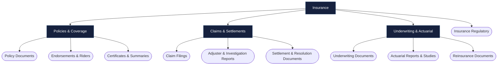

---

## 4. Healthcare & Medical

```mermaid
graph TD
    R4[Healthcare & Medical]

    R4 --> L4_1[Patient Records]
    R4 --> L4_2[Clinical]
    R4 --> L4_3[Pharmaceutical]
    R4 --> L4_4[Lab & Diagnostics]
    R4 --> L4_5[Healthcare Administration]

    L4_1 --> L4_1_1([Medical History & Demographics])
    L4_1 --> L4_1_2([Clinical Notes])
    L4_1 --> L4_1_3([Discharge & Transfer Documents])
    L4_1 --> L4_1_4([Consent & Authorization])

    L4_2 --> L4_2_1([Clinical Trial Protocols])
    L4_2 --> L4_2_2([Case Report Forms & Data])
    L4_2 --> L4_2_3([Adverse Event Reports])
    L4_2 --> L4_2_4([Regulatory Submissions - Clinical])

    L4_3 --> L4_3_1([Drug Approval & Registration])
    L4_3 --> L4_3_2([Prescriptions & Medication Records])
    L4_3 --> L4_3_3([Formulary & Drug Information])
    L4_3 --> L4_3_4([Pharmacovigilance])

    L4_4 --> L4_4_1([Laboratory Results])
    L4_4 --> L4_4_2([Diagnostic Imaging])
    L4_4 --> L4_4_3([Pathology Reports])
    L4_4 --> L4_4_4([Quality Control & Accreditation])

    L4_5 --> L4_5_1([Facility Licensing & Accreditation])
    L4_5 --> L4_5_2([Provider Credentialing])
    L4_5 --> L4_5_3([Payer & Reimbursement Documents])

    classDef branch fill:#16213e,color:#fff,stroke:#0f3460
    classDef leaf fill:#0f3460,color:#fff,stroke:#53a8b6
    class R4,L4_1,L4_2,L4_3,L4_4,L4_5 branch
```

---

## 5. Government & Public Administration

```mermaid
graph TD
    R5[Government & Public Administration]

    R5 --> L5_1[Identity Documents]
    R5 --> L5_2[Civil Records]
    R5 --> L5_3[Permits & Licenses]
    R5 --> L5_4[Public Policy & Legislation]
    R5 --> L5_5[Government Correspondence]

    L5_1 --> L5_1_1([Passports & Travel Documents])
    L5_1 --> L5_1_2([National & Government-Issued IDs])
    L5_1 --> L5_1_3([Drivers Licenses & Vehicle Documents])
    L5_1 --> L5_1_4([Residency & Immigration Documents])

    L5_2 --> L5_2_1([Birth & Death Records])
    L5_2 --> L5_2_2([Marriage & Domestic Partnership])
    L5_2 --> L5_2_3([Citizenship & Nationality])
    L5_2 --> L5_2_4([Name & Status Changes])

    L5_3 --> L5_3_1([Business & Commercial Licenses])
    L5_3 --> L5_3_2([Building & Construction Permits])
    L5_3 --> L5_3_3([Environmental Permits])
    L5_3 --> L5_3_4([Professional Licenses])

    L5_4 --> L5_4_1([Laws & Statutes])
    L5_4 --> L5_4_2([Regulations & Administrative Rules])
    L5_4 --> L5_4_3([Executive & Administrative Orders])
    L5_4 --> L5_4_4([Policy Papers & Proposals])

    L5_5 --> L5_5_1([Official Communications])
    L5_5 --> L5_5_2([FOI & Transparency Documents])
    L5_5 --> L5_5_3([Public Notices & Announcements])

    classDef branch fill:#16213e,color:#fff,stroke:#0f3460
    classDef leaf fill:#0f3460,color:#fff,stroke:#53a8b6
    class R5,L5_1,L5_2,L5_3,L5_4,L5_5 branch
```

---

## 6. Education & Research

```mermaid
graph TD
    R6[Education & Research]

    R6 --> L6_1[Academic Records]
    R6 --> L6_2[Curriculum & Instruction]
    R6 --> L6_3[Scientific Research]
    R6 --> L6_4[Grants & Funding]
    R6 --> L6_5[Institutional Administration]

    L6_1 --> L6_1_1([Transcripts & Grade Records])
    L6_1 --> L6_1_2([Diplomas & Certificates])
    L6_1 --> L6_1_3([Enrollment & Registration])

    L6_2 --> L6_2_1([Syllabi & Course Materials])
    L6_2 --> L6_2_2([Lesson Plans & Teaching Guides])
    L6_2 --> L6_2_3([Assessment & Evaluation Instruments])

    L6_3 --> L6_3_1([Research Papers & Publications])
    L6_3 --> L6_3_2([Research Data & Methodology])
    L6_3 --> L6_3_3([Peer Review & Editorial])

    L6_4 --> L6_4_1([Grant Proposals & Applications])
    L6_4 --> L6_4_2([Award & Agreement Documents])
    L6_4 --> L6_4_3([Grant Reporting & Administration])

    L6_5 --> L6_5_1([Accreditation Documents])
    L6_5 --> L6_5_2([Faculty & Staff Records])
    L6_5 --> L6_5_3([Program & Institutional Reviews])

    classDef branch fill:#16213e,color:#fff,stroke:#0f3460
    classDef leaf fill:#0f3460,color:#fff,stroke:#53a8b6
    class R6,L6_1,L6_2,L6_3,L6_4,L6_5 branch
```

---

## 7. Human Resources & Employment

```mermaid
graph TD
    R7[Human Resources & Employment]

    R7 --> L7_1[Recruitment & Talent Acquisition]
    R7 --> L7_2[Employee Records]
    R7 --> L7_3[Compensation & Benefits]
    R7 --> L7_4[Performance Management]
    R7 --> L7_5[Training & Development]

    L7_1 --> L7_1_1([Job Postings & Descriptions])
    L7_1 --> L7_1_2([Applications & Candidate Documents])
    L7_1 --> L7_1_3([Interview & Evaluation Records])
    L7_1 --> L7_1_4([Offer & Onboarding Documents])

    L7_2 --> L7_2_1([Personnel Files])
    L7_2 --> L7_2_2([Employment Contracts & Amendments])
    L7_2 --> L7_2_3([Separation Documents])

    L7_3 --> L7_3_1([Payroll Records])
    L7_3 --> L7_3_2([Benefits Enrollment & Administration])
    L7_3 --> L7_3_3([Equity & Incentive Plans])

    L7_4 --> L7_4_1([Performance Reviews & Appraisals])
    L7_4 --> L7_4_2([Goal Setting & Objectives])
    L7_4 --> L7_4_3([Performance Improvement])

    L7_5 --> L7_5_1([Training Programs & Materials])
    L7_5 --> L7_5_2([Certification & Compliance Training])
    L7_5 --> L7_5_3([Development Plans])

    classDef branch fill:#16213e,color:#fff,stroke:#0f3460
    classDef leaf fill:#0f3460,color:#fff,stroke:#53a8b6
    class R7,L7_1,L7_2,L7_3,L7_4,L7_5 branch
```

---

## 8. Sales, Marketing & Procurement

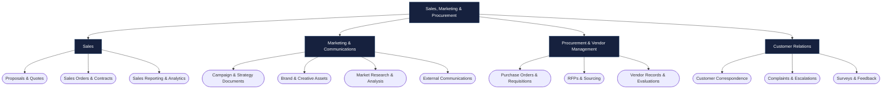

---

## 9. Technical & Product Documentation

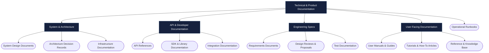

---

## 10. Operations & Corporate Governance

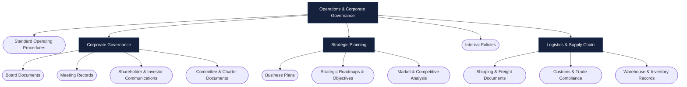

---

## 11. Real Estate & Property

```mermaid
graph TD
    R11[Real Estate & Property]

    R11 --> L11_1[Titles & Deeds]
    R11 --> L11_2[Leases & Rental]
    R11 --> L11_3([Appraisals & Valuations])
    R11 --> L11_4[Construction & Development]
    R11 --> L11_5[Property Management]

    L11_1 --> L11_1_1([Deeds & Transfers])
    L11_1 --> L11_1_2([Title Records & Insurance])
    L11_1 --> L11_1_3([Easements & Encumbrances])

    L11_2 --> L11_2_1([Lease Agreements])
    L11_2 --> L11_2_2([Tenant Management Documents])
    L11_2 --> L11_2_3([Lease Modifications & Terminations])

    L11_4 --> L11_4_1([Plans & Blueprints])
    L11_4 --> L11_4_2([Permits & Approvals])
    L11_4 --> L11_4_3([Inspection & Compliance])
    L11_4 --> L11_4_4([Contractor & Project Documents])

    L11_5 --> L11_5_1([Maintenance & Repair Records])
    L11_5 --> L11_5_2([Association & Community Documents])
    L11_5 --> L11_5_3([Property Financial Records])

    classDef branch fill:#16213e,color:#fff,stroke:#0f3460
    classDef leaf fill:#0f3460,color:#fff,stroke:#53a8b6
    class R11,L11_1,L11_2,L11_4,L11_5 branch
```

---

## 12. Creative & Literary Works

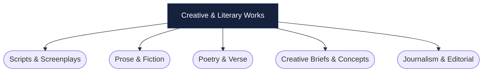
